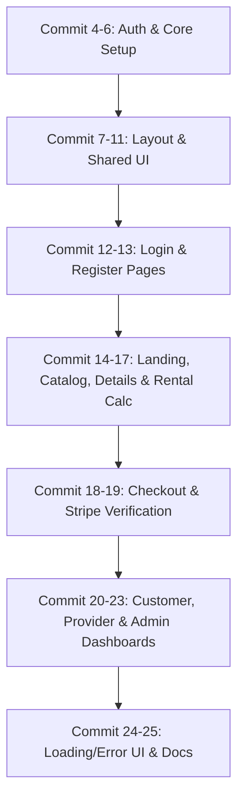

# Implementation Plan - GearUp Frontend Application 🏋️

Comprehensive implementation plan for **GearUp**, a modern sports and outdoor equipment rental service built with Next.js 15 (App Router), TypeScript, Tailwind CSS v4, Zustand, Axios, React Hook Form + Zod, and Stripe Payment integration.

---

## Existing Commits (3)
1. `baf8932`: `first commit`
2. `0a49fd9`: `initialized packages and setup openspec, api integrations`
3. `765bb68`: `ts interface matching backend data models`

---

## User Review Required

> [!IMPORTANT]
> **Commit Target Strategy**
> The plan outlines **22 new commits** (Commits #4 through #25, totaling 25 commits) following conventional commit standards (`feat:`, `fix:`, `refactor:`, `docs:`).
> 
> **Backend Integration Details**
> - **Base URL**: `https://backend-gear-up-prisma-stripe.vercel.app/api/v1`
> - **Auth**: Bearer Token stored in cookies & Zustand auth state.
> - **Payment Gateway**: Stripe Checkout & `/payments/verify` callback.

---

## 22+ Commit Breakdown Plan

### Phase 1: Infrastructure & Auth Core (Commits 4 - 6)
- **Commit 4**: `feat(api): setup custom axios instance with auth interceptor and unified error handling`
  - Location: [axios.ts](file:///d:/Software/All%20Bangla%20Font/Z-er/New%20folder/assi/Frontend_Gear_up_prisma_Stripe/src/lib/axios.ts)
  - Configure `axios` with base URL `https://backend-gear-up-prisma-stripe.vercel.app/api/v1`.
  - Add request interceptor for JWT authorization header (`Bearer <token>`).
  - Add response interceptor with `sonner` toast error notifications.

- **Commit 5**: `feat(auth): implement zustand auth store with persistent token and user state`
  - Location: [useAuthStore.ts](file:///d:/Software/All%20Bangla%20Font/Z-er/New%20folder/assi/Frontend_Gear_up_prisma_Stripe/src/store/useAuthStore.ts)
  - Create Zustand store for managing user session, active token, role, and loading state.
  - Implement cookie-based token persistence for SSR & middleware.

- **Commit 6**: `feat(middleware): create nextjs middleware for role-based route protection`
  - Location: [middleware.ts](file:///d:/Software/All%20Bangla%20Font/Z-er/New%20folder/assi/Frontend_Gear_up_prisma_Stripe/src/middleware.ts)
  - Protect `/dashboard/*` routes.
  - Validate role permissions for `/dashboard/customer`, `/dashboard/provider`, and `/dashboard/admin`.

---

### Phase 2: Design System & Core UI Components (Commits 7 - 11)
- **Commit 7**: `feat(ui): build base design tokens, root layout, and toast notification provider`
  - Location: [layout.tsx](file:///d:/Software/All%20Bangla%20Font/Z-er/New%20folder/assi/Frontend_Gear_up_prisma_Stripe/src/app/layout.tsx), [globals.css](file:///d:/Software/All%20Bangla%20Font/Z-er/New%20folder/assi/Frontend_Gear_up_prisma_Stripe/src/app/globals.css)
  - Setup Inter font, global CSS custom properties, and Sonner `<Toaster />`.

- **Commit 8**: `feat(ui): create reusable loading skeleton and UI badge components`
  - Location: [LoadingSkeleton.tsx](file:///d:/Software/All%20Bangla%20Font/Z-er/New%20folder/assi/Frontend_Gear_up_prisma_Stripe/src/components/ui/LoadingSkeleton.tsx), [Badge.tsx](file:///d:/Software/All%20Bangla%20Font/Z-er/New%20folder/assi/Frontend_Gear_up_prisma_Stripe/src/components/ui/Badge.tsx), [Modal.tsx](file:///d:/Software/All%20Bangla%20Font/Z-er/New%20folder/assi/Frontend_Gear_up_prisma_Stripe/src/components/ui/Modal.tsx)
  - Build animated skeleton placeholders, status badges, and reusable dialog modal wrapper.

- **Commit 9**: `feat(nav): add responsive header navbar with dynamic auth state and role badges`
  - Location: [Navbar.tsx](file:///d:/Software/All%20Bangla%20Font/Z-er/New%20folder/assi/Frontend_Gear_up_prisma_Stripe/src/components/shared/Navbar.tsx)
  - Responsive header featuring branding logo, navigation links, user dropdown, and login/register action buttons.

- **Commit 10**: `feat(footer): add platform footer with quick navigation links and branding`
  - Location: [Footer.tsx](file:///d:/Software/All%20Bangla%20Font/Z-er/New%20folder/assi/Frontend_Gear_up_prisma_Stripe/src/components/shared/Footer.tsx)
  - Footer component with links, category tags, payment partner badges, and copyright notice.

- **Commit 11**: `feat(gear-card): build responsive equipment card component with availability indicators`
  - Location: [GearCard.tsx](file:///d:/Software/All%20Bangla%20Font/Z-er/New%20folder/assi/Frontend_Gear_up_prisma_Stripe/src/components/gear/GearCard.tsx)
  - Card view for gear item displaying optimized image (`next/image`), price/day, availability status badge, and view details link.

---

### Phase 3: Auth Pages & Flows (Commits 12 - 13)
- **Commit 12**: `feat(auth): implement client login page with zod validation and error feedback`
  - Location: [page.tsx](file:///d:/Software/All%20Bangla%20Font/Z-er/New%20folder/assi/Frontend_Gear_up_prisma_Stripe/src/app/login/page.tsx)
  - Login page with React Hook Form + Zod schema validation, API error handling, and redirection.

- **Commit 13**: `feat(auth): implement user registration page with customer and provider role selector`
  - Location: [page.tsx](file:///d:/Software/All%20Bangla%20Font/Z-er/New%20folder/assi/Frontend_Gear_up_prisma_Stripe/src/app/register/page.tsx)
  - Registration page with user details inputs and role toggle (`CUSTOMER` vs `PROVIDER`).

---

### Phase 4: Public & Gear Discovery Pages (Commits 14 - 17)
- **Commit 14**: `feat(landing): create home page with hero section, category showcase, and featured gear`
  - Location: [page.tsx](file:///d:/Software/All%20Bangla%20Font/Z-er/New%20folder/assi/Frontend_Gear_up_prisma_Stripe/src/app/page.tsx)
  - Hero banner with CTA, category cards showcase, featured gear grid, and platform statistics.

- **Commit 15**: `feat(catalog): implement gear listing page with search, category, price range, and date filters`
  - Location: [page.tsx](file:///d:/Software/All%20Bangla%20Font/Z-er/New%20folder/assi/Frontend_Gear_up_prisma_Stripe/src/app/gear/page.tsx)
  - Gear directory with sidebar filtering (search, price slider, category dropdown), pagination, and URL state sync.

- **Commit 16**: `feat(gear-details): implement single gear detail page with gallery, specs, and reviews`
  - Location: [page.tsx](file:///d:/Software/All%20Bangla%20Font/Z-er/New%20folder/assi/Frontend_Gear_up_prisma_Stripe/src/app/gear/[id]/page.tsx)
  - Dedicated gear page showing detailed specs, provider profile, image gallery, and review list.

- **Commit 17**: `feat(rental-calc): integrate dynamic rental date calculator widget and order initiation`
  - Location: [RentalCalculator.tsx](file:///d:/Software/All%20Bangla%20Font/Z-er/New%20folder/assi/Frontend_Gear_up_prisma_Stripe/src/components/gear/RentalCalculator.tsx)
  - Interactive date picker calculating rental duration and price (`totalPrice = days * pricePerDay`) with instant order submission (`POST /orders`).

---

### Phase 5: Checkout & Stripe Payment Flow (Commits 18 - 19)
- **Commit 18**: `feat(checkout): implement rental checkout summary and stripe elements checkout flow`
  - Location: [page.tsx](file:///d:/Software/All%20Bangla%20Font/Z-er/New%20folder/assi/Frontend_Gear_up_prisma_Stripe/src/app/checkout/[orderId]/page.tsx)
  - Checkout screen displaying rental summary and embedding Stripe payment initialization.

- **Commit 19**: `feat(payment): build stripe payment verification success callback and cancellation pages`
  - Location: [page.tsx](file:///d:/Software/All%20Bangla%20Font/Z-er/New%20folder/assi/Frontend_Gear_up_prisma_Stripe/src/app/payment/success/page.tsx), [page.tsx](file:///d:/Software/All%20Bangla%20Font/Z-er/New%20folder/assi/Frontend_Gear_up_prisma_Stripe/src/app/payment/cancel/page.tsx)
  - `/payment/success` page that sends `/payments/verify` verification request to backend and displays transaction receipt.

---

### Phase 6: Role-Based Dashboard Interfaces (Commits 20 - 23)
- **Commit 20**: `feat(dashboard-customer): create customer dashboard for rental history and payment receipts`
  - Location: [page.tsx](file:///d:/Software/All%20Bangla%20Font/Z-er/New%20folder/assi/Frontend_Gear_up_prisma_Stripe/src/app/dashboard/customer/page.tsx)
  - Customer panel with rental orders tab (status badges: `PENDING`, `CONFIRMED`, `PICKED_UP`, `RETURNED`, `CANCELLED`) and payment receipt table.

- **Commit 21**: `feat(reviews): add customer review modal for completed rental feedback`
  - Location: [WriteReviewModal.tsx](file:///d:/Software/All%20Bangla%20Font/Z-er/New%20folder/assi/Frontend_Gear_up_prisma_Stripe/src/components/dashboard/WriteReviewModal.tsx)
  - Star rating and review input form for returned items submitting to `/reviews`.

- **Commit 22**: `feat(dashboard-provider): build provider dashboard with gear creation modal and status update flow`
  - Location: [page.tsx](file:///d:/Software/All%20Bangla%20Font/Z-er/New%20folder/assi/Frontend_Gear_up_prisma_Stripe/src/app/dashboard/provider/page.tsx)
  - Provider inventory view with Add Gear modal (`POST /gear`) and rental order status management table (`PATCH /orders/:id/status`).

- **Commit 23**: `feat(dashboard-admin): implement admin dashboard for user management, analytics, and category creation`
  - Location: [page.tsx](file:///d:/Software/All%20Bangla%20Font/Z-er/New%20folder/assi/Frontend_Gear_up_prisma_Stripe/src/app/dashboard/admin/page.tsx)
  - Admin panel showing overall metrics, user list with suspend/activate actions (`GET /users`), and category management form (`POST /categories`).

---

### Phase 7: Error Fallbacks, Documentation & Polish (Commits 24 - 25)
- **Commit 24**: `feat(error-handling): add root loading skeleton, error fallback boundaries, and 404 page`
  - Location: [loading.tsx](file:///d:/Software/All%20Bangla%20Font/Z-er/New%20folder/assi/Frontend_Gear_up_prisma_Stripe/src/app/loading.tsx), [error.tsx](file:///d:/Software/All%20Bangla%20Font/Z-er/New%20folder/assi/Frontend_Gear_up_prisma_Stripe/src/app/error.tsx), [not-found.tsx](file:///d:/Software/All%20Bangla%20Font/Z-er/New%20folder/assi/Frontend_Gear_up_prisma_Stripe/src/app/not-found.tsx)
  - App Router error boundaries, global skeleton loaders, and 404 page UI.

- **Commit 25**: `docs & polish: update api documentation, project documentation, and build verification`
  - Location: [README.md](file:///d:/Software/All%20Bangla%20Font/Z-er/New%20folder/assi/Frontend_Gear_up_prisma_Stripe/README.md), [API_INTEGRATION.md](file:///d:/Software/All%20Bangla%20Font/Z-er/New%20folder/assi/Frontend_Gear_up_prisma_Stripe/API_INTEGRATION.md)
  - README updates with setup guide, live demo links, features summary, and final `npm run build` verification.

---

## Verification Plan

### Automated Checks
- `npm run lint`: Verify zero TypeScript / ESLint warnings or errors.
- `npm run build`: Verify clean Next.js 15 production build.

### Functional Verification
- Verify JWT login & signup flow for Customer, Provider, and Admin users.
- Test route protection using Next.js Middleware.
- Verify price computation and date picking on `/gear/[id]`.
- Verify Stripe Checkout payment initialization and `/payment/success` verification callback.
- Verify order status updates in Provider Dashboard and User active/suspend toggle in Admin Dashboard.
